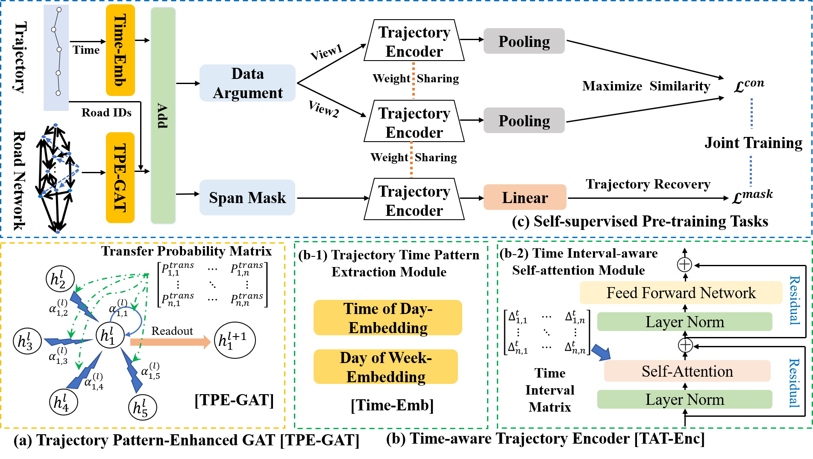

# [ICDE2023] Self-supervised Trajectory Representation Learning with Temporal Regularities and Travel Semantics

**Update 2023/06/20: We released the BJ-data, please see the Data section to obtain it.**

This is a PyTorch implementation of Self-supervised Trajectory Representation Learning with Temporal Regularities and Travel Semantics Framework (**START**) for generic trajectory representation learning, as described in our paper: Jiawei Jiang, Dayan Pan, Houxing Ren, Xiaohan Jiang, Chao Li, Jingyuan Wang,  **[Self-supervised Trajectory Representation Learning with Temporal Regularities and Travel Semantics](https://arxiv.org/abs/2211.09510)**, ICDE2023.



## Requirements

Our code is based on Python version 3.7 and PyTorch version 1.7.1. Please make sure you have installed Python and PyTorch correctly. Then you can install all the dependencies with the following command by pip:

```
pip install -r requirements.txt
```

## Data

We conduct our experiments on two trajectory datasets and corresponding road networks, including **BJ** and **Porto**. We provide a link to download the processed dataset in Google Drive. [Click here](https://drive.google.com/file/d/14yTivaV41gst0_k4ufHBHSV205tcRNqb/view?usp=share_link) to download the zip files. If you want to use these datasets, you need to unzip them first. And, you need to create the raw_data/ directory manually. 

For example, if you unzip the **Porto** dataset, please make sure your directory structure is as follows:

- `START/raw_data/porto_roadmap_edge_porto_True_1_merge/...`
- `START/raw_data/porto/...`

Here `porto_roadmap_edge_porto_True_1_merge/` stores the road network data, and `porto/` stores the trajectory data.

~~For data privacy, we did not release the BJ data.~~

We released the Beijing trajectory dataset collected in November 2015, including 1018312 trajectories. We obtained the corresponding road network data from OpenStreetMap and preprocessed the trajectory data to get the Beijing trajectory dataset matched to the road network, and we believed that this dataset could promote the development of urban trajectory mining tasks. Please refer to file [bj-data-introduction.md](./bj-data-introduction.md) for a more detailed data introduction. [Data Download](https://pan.baidu.com/s/1TbqhtImm_dWQZ1-9-1XsIQ?pwd=1231)

## Pre-Train

You can pre-train **START** through the following commands：

```shell
# Porto
python run_model.py --model BERTContrastiveLM --dataset porto --config porto --gpu_id 0 --mlm_ratio 0.6 --contra_ratio 0.4 --split true --distribution geometric --avg_mask_len 2 --out_data_argument1 trim --out_data_argument2 shift

# BJ
python run_model.py --model BERTContrastiveLM --dataset bj --config bj --gpu_id 1 --mlm_ratio 0.6 --contra_ratio 0.4 --split true --distribution geometric --avg_mask_len 2 --out_data_argument1 trim --out_data_argument2 shift
```

The default data enhancement method is used here, i.e.,  *Trajectory Trimming* and *Temporal Shifting*.

A field `exp_id` is generated to mark the experiment number during the experiment, and the pre-trained model will be stored at `libcity/cache/{exp_id}/model_cache/{exp_id}_{model_name}_{dataset}.pt`

 ## Fine-tune

We can fine-tune the model for downstream tasks. Note that you need to modify the `exp_id` field in the following command.

(1) Travel Time Prediction

```shell
# Porto
python run_model.py --model LinearETA --dataset porto --gpu_id 0 --config porto --pretrain_path libcity/cache/{exp_id}/model_cache/{exp_id}_BERTContrastiveLM_porto.pt

# BJ
python run_model.py --model LinearETA --dataset bj --gpu_id 0 --config bj --pretrain_path libcity/cache/{exp_id}/model_cache/{exp_id}_BERTContrastiveLM_bj.pt
```

(2) Trajectory Classification

```shell
# Porto
python run_model.py --model LinearClassify --dataset porto --gpu_id 0 --config porto --pretrain_path libcity/cache/{exp_id}/model_cache/{exp_id}_BERTContrastiveLM_porto.pt

# BJ
python run_model.py --model LinearClassify --dataset bj --gpu_id 0 --config bj --pretrain_path libcity/cache/{exp_id}/model_cache/{exp_id}_BERTContrastiveLM_bj.pt
```

(3) Trajectory Similarity Computation

This task does not require fine-tuning. 

Here `query_data_path` is the file name of the query dataset, `detour_data_path` is the file name of the detoured dataset, and `origin_big_data_path` is the file name of the database (Negative samples).

(3.1) Most Similar Trajectory Search

```shell
# Porto
python run_model.py --model LinearSim --dataset porto --gpu_id 0 --config porto --query_data_path porto_decup_origin_test_topk0.2_0.2_1.0_10000 --detour_data_path porto_decup_detoured_test_topk0.2_0.2_1.0_10000 --origin_big_data_path porto_decup_othersdetour_test_topk0.2_0.2_1.0_10000_100000 --sim_mode most --topk 1 5 10 --pretrain_path libcity/cache/{exp_id}/model_cache/{exp_id}_BERTContrastiveLM_porto.pt

# BJ
python run_model.py --model LinearSim --dataset bj --gpu_id 0 --config bj --query_data_path beijing_decup_origin_test_topk0.2_0.2_1.0_10000 --detour_data_path beijing_decup_detoured_test_topk0.2_0.2_1.0_10000 --origin_big_data_path beijing_decup_othersdetour_test_topk0.2_0.2_1.0_10000_100000 --sim_mode most --topk 1 5 10 --pretrain_path libcity/cache/{exp_id}/model_cache/{exp_id}_BERTContrastiveLM_bj.pt
```

(3.2) $k$​-nearest trajectory search

```shell
# Porto
python run_model.py --model LinearSim --dataset porto --gpu_id 0 --config porto --query_data_path porto_decup_origin_test_topk0.2_0.2_1.0_10000 --detour_data_path porto_decup_detoured_test_topk0.2_0.2_1.0_10000 --origin_big_data_path porto_decup_others_test_topk0.2_0.2_1.0_10000 --sim_mode knn --topk 5 --pretrain_path libcity/cache/{exp_id}/model_cache/{exp_id}_BERTContrastiveLM_porto.pt

# BJ
python run_model.py --model LinearSim --dataset bj --gpu_id 0 --config bj --query_data_path beijing_decup_origin_test_topk0.2_0.2_1.0_10000 --detour_data_path beijing_decup_detoured_test_topk0.2_0.2_1.0_10000 --origin_big_data_path beijing_decup_others_test_topk0.2_0.2_1.0_10000 --sim_mode knn --topk 5  --pretrain_path libcity/cache/{exp_id}/model_cache/{exp_id}_BERTContrastiveLM_bj.pt
```

## Others

Here we describe some of the necessary data processing procedures, which can be time-consuming. Note that the processed data is already included in our zip file, so **you can skip this section**. 

(1) Create a data mapping dictionary and recode the road IDs.

```shell
# Porto
python setup_vocab.py --dataset porto --roadnetwork porto_roadmap_edge
# BJ
python setup_vocab.py --dataset bj --roadnetwork bj_roadmap_edge
```

(2) Calculate the road transfer probability matrix.

```shell
# Porto
python trans_prob.py --dataset porto
# BJ
python trans_prob.py --dataset bj
```

## Reference Code

The code references several open source repositories, to whom thanks are expressed here, including [LibCity](https://github.com/LibCity/Bigscity-LibCity), [pytorch-GAT](https://github.com/gordicaleksa/pytorch-GAT), [mvts_transformer](https://github.com/gzerveas/mvts_transformer), [ConSERT](https://github.com/yym6472/ConSERT).

## Cite

If you find the paper useful, please cite as following:

```
@inproceedings{jiang2023start,
  title={Self-supervised Trajectory Representation Learning with Temporal Regularities and Travel Semantics},
  author={Jiawei Jiang and Dayan Pan and Houxing Ren and Xiaohan Jiang and Chao Li and Jingyuan Wang},
  booktitle={2023 IEEE 39th international conference on data engineering (ICDE)},
  year={2023},
  organization={IEEE}
}
```

